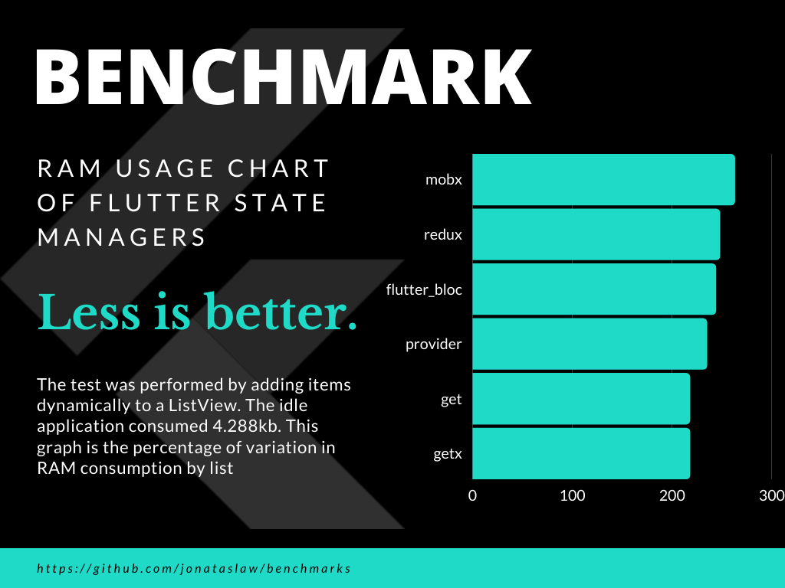

# benchmarks
A repository to benchmark Flutter libs.
Creators of the tested libs can suggest improvements, as long as they follow the same design structure.

# 1- State Managers

The idle application consumes 4.0mb of ram.
Items were added dynamically to a ListView, and after the test was completed, a screenshot was taken. The garbage collector was triggered manually, and another screenshot was taken.
The added RAM added to the idle application was measured.

A more robust benchmark is being made and the typo in Banners will be replaced.

